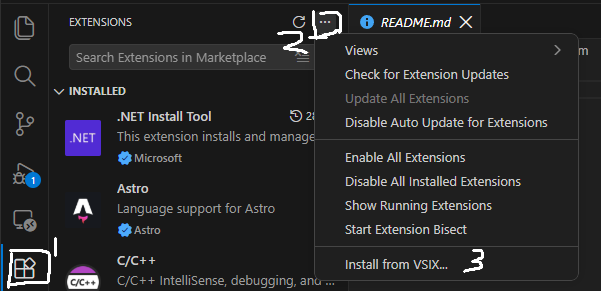
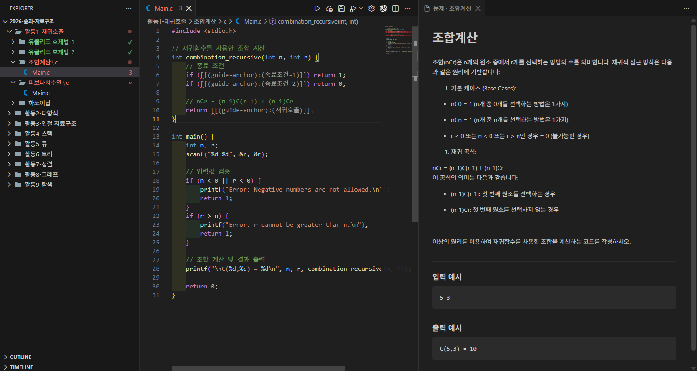
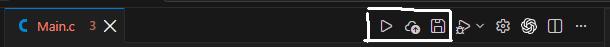

# vscode-goorm

VSCode에서 구름EDU의 문제를 풀 수 있는 확장 프로그램입니다.  
아직 버그가 많을 수 있습니다. [Issues](https://github.com/Pro203S/vscode-goorm/issues)에 제보해주시면 감사하겠습니다.  

## 설치하기

1. [Releases](https://github.com/Pro203S/vscode-goorm/releases)
2. 왼쪽 활동 바의 확장을 클릭합니다.
3. 맨 위 점 3개 버튼을 클릭합니다.
4. `Install from VSIX...`를 클릭합니다.
5. 다운받았던 VSIX 파일을 선택합니다.

## 사용하기

맨 아래 상태 바에 구름EDU 아이콘을 클릭하면 기존 워크스페이스를 열거나, 새 워크스페이스를 만들 수 있습니다.  

맨 위에 선택 창에서 작업을 진행해주세요.

## 워크스페이스

구름EDU 워크스페이스의 모습:

실행, 제출, 저장은 아래 버튼들로 할 수 있습니다.  

저장은 탭 바의 버튼뿐만 아니라 Ctrl+S 등으로 저장을 할 수 있습니다.  
저장하면 구름EDU에도 저장됩니다.  

## 주의사항

- 워크스페이스 폴더의 `.goorm` 폴더를 함부로 수정하거나, 삭제하지 마세요.  
- 구름EDU 서버에 접속할 수 없으면 워크스페이스가 열리지 않습니다.

## 업데이트 로그

